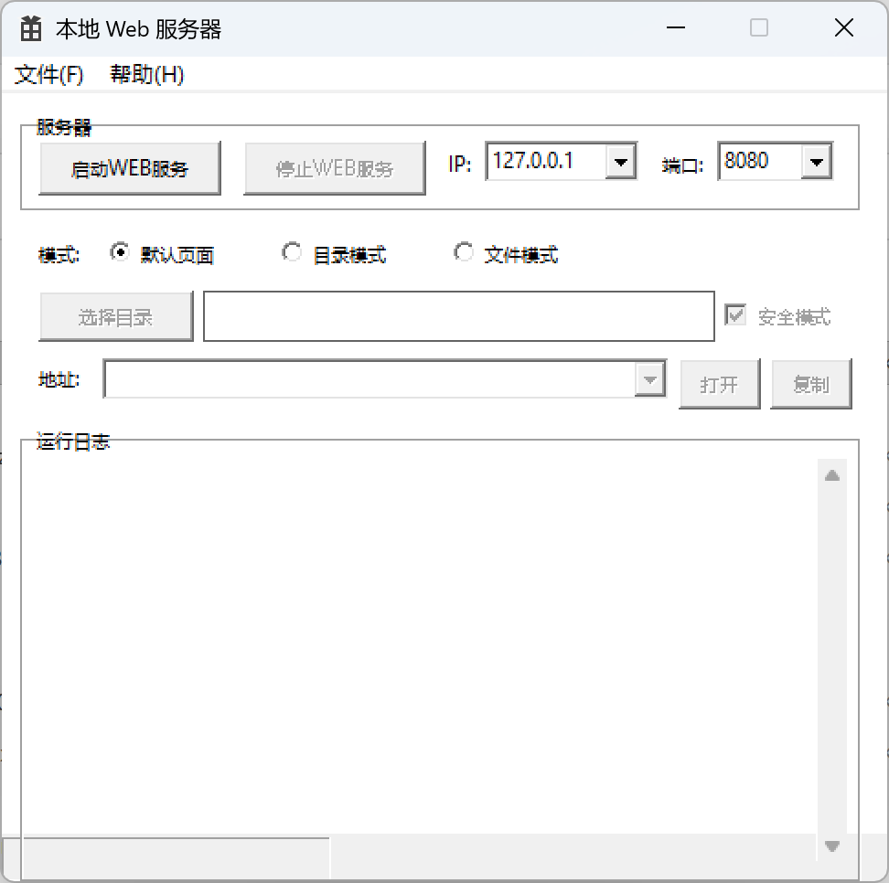

# 本地 Web 服务器

[](https://github.com/Aris-X/tiny-web-server/actions/workflows/build.yml)
[](https://github.com/Aris-X/tiny-web-server/releases)
[](https://github.com/Aris-X/tiny-web-server/releases)
[](LICENSE)


一个基于 Crow + Win32 API 的嵌入式 Web 服务器桌面工具，支持目录/文件模式、IP/端口配置、安全模式等。

## 下载

从 [Releases](https://github.com/Aris-X/tiny-web-server/releases) 页面下载最新版本的可执行文件（无需安装，直接运行）。



## 功能

- 一键启动/停止/重启 Web 服务
- 三种模式：默认页面、目录模式、文件模式
- 文件模式支持安全模式（仅暴露 `/` 路由）
- 下拉选择 IP 地址（支持 `0.0.0.0` 自动枚举本机 IP）
- 自定义端口
- 状态栏实时显示运行状态
- 运行日志
- 使用教程（帮助菜单）

## 构建

### 前置要求

- Visual Studio 2022（含 C++ 桌面开发工作负载）
- vcpkg（已启用清单模式，自动安装 Crow 依赖）

### 步骤

1. 克隆仓库
2. 用 Visual Studio 打开 `WindowsProject1.slnx`
3. 选择 Release/x64 或 Release/Win32 配置
4. 生成解决方案

或命令行：

```bash
msbuild WindowsProject1.vcxproj /p:Configuration=Release /p:Platform=x64
```

Win32：

```bash
msbuild WindowsProject1.vcxproj /p:Configuration=Release /p:Platform=Win32
```

## 使用

1. 选择模式（默认/目录/文件）
2. 设置 IP 和端口
3. 点击「启动 WEB 服务」开始运行
4. 在地址栏选择 URL，点击「打开」访问或「复制」复制链接
5. 点击「停止 WEB 服务」关闭
6. 已启动时可随时点击「重启 WEB 服务」以新配置重启

## 依赖

- [Crow](https://github.com/CrowCpp/Crow) — C++ HTTP 框架
- [Asio](https://think-async.com/Asio/) — 异步网络库
- Win32 API

## 作者

Aris

## 许可证

本项目完全开源，仅供学习交流使用。**禁止任何商业用途**。

如需商业使用，请联系作者（Aris）获取授权。
